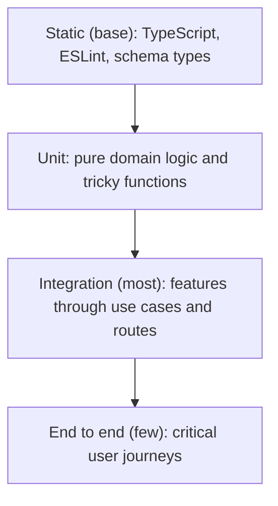

# Architecture and coding standards: Flashcards app

Status: Draft for review
Owner: [NEED: tech lead name]
Last updated: 2026-05-30
Companion to: `prd-flashcards-app.md`

---

## Purpose

This document records the architecture decisions and the coding rules for the flashcards app described in the PRD. It is the reference an engineer reads before writing a feature. It explains which patterns to use, where to use them, and which to avoid so the codebase stays consistent and the tests stay fast.

The PRD set one ground rule: keep it lean and avoid overengineering. Every decision below is weighed against that rule. We pick the lightest pattern that solves the problem, and we add structure only where it pays for itself.

---

## Guiding principles

1. **Match the pattern to the problem.** Most of this app is plain create-read-update-delete. Thin code beats a rich domain model for thin logic. Reach for heavier patterns only where real behavior lives.
2. **Protect the seams that are expensive to change later.** Put a thin interface in front of the database and the AI provider now, because retrofitting one later is costly and these seams make tests fast today.
3. **YAGNI on features, not on testability.** Do not build for imagined needs. But do keep external dependencies behind small interfaces, because that pays off in the first week of testing.
4. **Optimize for change.** Code is read and edited far more than it is written. Favor clarity over cleverness.

---

## Architecture decisions

Each decision uses a short record format: context, decision, and consequences.

### ADR-001: Use a modular layered architecture, not a single pattern everywhere

**Context.** The app has two kinds of logic. Most of it is thin (create a deck, edit a card). One part has real behavior worth modeling (AI card generation rules, study-session re-queue, and later, spaced-repetition scheduling). A single dogmatic choice, full domain model everywhere or scripts everywhere, would either overbuild the simple parts or underbuild the complex parts.

**Decision.** Use a layered architecture with three layers:

- **Web layer**: Next.js route handlers, server actions, and React components. Handles HTTP, sessions, input parsing, and rendering. No business rules here.
- **Application layer**: use cases (one function per user action, for example `createCard`, `generateCardDrafts`). This layer orchestrates: it validates input, calls the domain where needed, and calls ports for data and external services.
- **Domain layer (thin)**: pure functions and small types that hold real rules. For the MVP this is small: flashcard validation rules, study-session logic, and the AI draft validator.

For simple actions the use case reads like a transaction script: validate, persist, return. That is intentional and correct for CRUD.

**Consequences.** Engineers do not have to decide the architecture per feature. CRUD stays thin. Behavior-heavy features have a clear home. The layering is light enough that no one fights it.

### ADR-002: Use which pattern, domain model or transaction script, per feature

**Context.** The team asked whether to use a domain model or transaction scripts.

**Decision.** Use both, deliberately, based on the feature:

| Feature | Pattern | Why |
|---|---|---|
| Auth (register, login) | Transaction script | Standard flows, little branching behavior |
| Deck CRUD | Transaction script | Pure data operations |
| Card CRUD | Transaction script | Pure data operations, with one small rule set (length, single concept) extracted to the domain |
| AI card generation | Domain logic + use case | Prompt building and draft validation are real rules worth isolating and testing |
| Study session | Domain logic | Re-queue and session state have behavior |
| Spaced repetition (phase 2) | Domain model | Scheduling is genuine domain logic; model it when it arrives |

**Consequences.** We do not wrap a `Deck` with no behavior in a rich entity just to follow a pattern. We do isolate the rules that exist so they are unit-testable without a database or a network.

### ADR-003: Apply light hexagonal (ports and adapters) only at external boundaries

**Context.** Full hexagonal architecture across a small Next.js app would add ceremony the app does not need. But two dependencies, the database and the AI provider, are exactly what ports and adapters were made for.

**Decision.** Define a small **port** (a TypeScript interface) for each external dependency, and put the concrete code behind an **adapter**:

- `DeckRepository`, `CardRepository`, `UserRepository`: ports for persistence. Adapter implemented with the chosen ORM ( Drizzle) over Postgres.
- `AiCardGenerator`: port for AI drafting. Adapter implemented with the Anthropic API.
- `AuthGateway` (thin): a small interface over the auth library so use cases ask "who is the current user" without binding to one vendor.

Use cases depend on the **port interfaces**, never on the ORM client or the model SDK directly. Wiring happens at the edge (the route handler or a small composition root).

Do not create ports for things that are not external and swappable. No port for a utility function.

**Consequences.** Tests run against in-memory or fake adapters, so most tests need no database and no network. Swapping the AI provider or the ORM later touches one adapter, not the whole codebase. The cost is one small interface per boundary, which is cheap and justified by the testing benefit today, not by speculation.

### ADR-004: Organize code by feature (vertical slices), not by technical layer alone

**Context.** Grouping every component in one folder, every use case in another, and every repository in a third spreads a single feature across the tree and makes change harder.

**Decision.** Group by feature first, then by layer inside the feature. Shared building blocks live in a small `shared` area.

**Consequences.** A change to "cards" mostly touches `features/cards`. New engineers find code by the feature they are working on. This fits the Next.js App Router well.

### ADR-005: Enforce one dependency direction

**Context.** Layered code rots when an inner layer reaches out to an outer one (for example, domain code importing the ORM).

**Decision.** Dependencies point inward only:

```
Web  ->  Application (use cases)  ->  Domain
                 |
                 v
              Ports  <-  Adapters (DB, AI, auth) implement ports
```

- The domain layer imports nothing from web, application, or adapters. It is pure.
- Use cases import the domain and the port interfaces, never adapters.
- Adapters import ports and implement them. Adapters may import the ORM and SDKs.
- The web layer imports use cases and composes adapters at the edge.

Add a lint rule (for example `eslint-plugin-boundaries` or import restrictions) to enforce this automatically.

**Consequences.** The domain and use cases stay testable in isolation. Violations fail the build, not a review.

### ADR-006: Validate and shape errors at the boundary

**Context.** Untrusted input enters at the web layer. The org security standard (SOC2) requires validated input and no leaking of internals.

**Decision.**
- Validate every external input at the web layer with a schema library (for example Zod). Reject bad input before it reaches a use case.
- Use cases return typed results. Map known failures (not found, not authorized, validation) to the right HTTP status at the web layer.
- Never return raw database or model errors to the client. Log details server-side, return a safe message.
- Enforce ownership inside the use case or repository, so a user cannot read or write another user's deck or card (SOC2 least privilege).

**Consequences.** A consistent validation and error story across features, and authorization that is checked in code rather than assumed.

### ADR-007: Test with the Testing Trophy model

See the "Testing approach" section below. Summary decision: weight the suite toward integration tests, supported by static analysis and unit tests, with a thin layer of end-to-end tests on critical journeys.

---

## Target structure

A feature-first tree that reflects the decisions above:

```
src/
  app/                      # Next.js App Router (web layer)
    (auth)/                 # login, register routes
    decks/                  # deck pages
    decks/[deckId]/         # deck view, study, cards
    api/                    # route handlers (thin: parse, call use case, map result)
  features/
    auth/
      use-cases/            # registerUser, loginUser
      domain/               # password policy, session rules (thin)
      ui/                   # auth components
    decks/
      use-cases/            # createDeck, listDecks, updateDeck, deleteDeck
      ui/
    cards/
      use-cases/            # createCard, updateCard, deleteCard, listCards
      domain/               # card rules: length cap, single-concept hints
      ui/
    study/
      use-cases/            # startSession, recordResult
      domain/               # re-queue logic, session state
      ui/
    ai/
      use-cases/            # generateCardDrafts, saveSelectedDrafts
      domain/               # prompt builder, draft validator (flashcard rules)
      ui/
  ports/                    # interfaces: DeckRepository, CardRepository, AiCardGenerator, AuthGateway
  adapters/
    db/                     # ORM-backed repositories implementing the ports
    ai/                     # Anthropic-backed AiCardGenerator
    auth/                   # auth library behind AuthGateway
  shared/                   # cross-cutting helpers, types, validation schemas, errors
tests/
  e2e/                      # Playwright journeys
```

---

## Coding standards and rules

These rules apply to all code. They are short on purpose. When two rules seem to conflict, favor the one that makes the code easier to read and change.

### Clean Code

- Names say what something is or does. A reader should not need a comment to understand a well-named function.
- Functions do one thing and stay small. If a function needs a comment to separate its sections, split it.
- Prefer clear code over comments. Write comments to explain *why*, not *what*. Delete commented-out code.
- No magic numbers or strings. Name them.
- Keep nesting shallow. Return early to avoid deep `if` pyramids.
- Leave each file a little cleaner than you found it.

### SOLID, applied to this app

- **Single responsibility.** A use case handles one user action. The AI adapter only talks to the model. A repository only persists. If a file has two reasons to change, split it.
- **Open and closed.** Adding a new way to create cards (AI, and later import) means adding a new adapter or use case, not editing the existing ones. The `AiCardGenerator` port makes this possible.
- **Liskov substitution.** Every implementation of a port must honor the same contract. A fake `AiCardGenerator` used in tests must behave like the real one from the use case's point of view.
- **Interface segregation.** Keep ports small and focused. Use one repository interface per aggregate (`CardRepository`, `DeckRepository`), not one large `Database` interface with every method.
- **Dependency inversion.** Use cases depend on port interfaces, and adapters implement them. The concrete database and model code is wired at the edge. This is the rule ADR-003 and ADR-005 encode.

### DRY, with limits

- Remove real duplication of knowledge. One rule should live in one place (for example, the card length cap is defined once and used by both the manual editor and the AI validator).
- Apply the rule of three. Two similar pieces of code are not always duplication. Wait until a third use shows the real shared shape before extracting an abstraction.
- A wrong abstraction costs more than a little duplication. Do not couple two features just because their code looks alike today.
- Duplication in tests is often fine. Readable, self-contained tests beat clever shared test helpers.

### YAGNI

- Build what the MVP needs, not what it might need. Do not build the MCP server, spaced-repetition scheduling, multi-provider AI abstraction, or media cards until they are scheduled work.
- One exception, stated plainly: the ports in ADR-003 are not speculation. They earn their place now by making tests fast and the AI and database swappable at low cost. We add seams that are cheap now and expensive later, and nothing else.
- Delete code that nothing uses. Dead code is a maintenance cost.

### TypeScript and general rules

- Strict mode on. No implicit `any`. Prefer precise types over `any` and over wide unions.
- Make illegal states unrepresentable where it is easy (for example, a discriminated union for a use-case result instead of a loose object).
- Keep functions pure where you can. Side effects (database, network) belong in adapters and use cases, not in the domain layer.
- Handle errors explicitly. Do not swallow them.

### Security rules (from the PRD, SOC2 aligned)

- No hardcoded secrets. Load keys and connection strings from the secret manager through environment variables. The AI key stays server-side.
- Validate all external input at the boundary (ADR-006).
- Enforce per-user ownership on every read and write of decks and cards (least privilege).
- Do not log secrets or personal data. Redact PII in logs.

---

## Testing approach: the Testing Trophy

The team asked for the Testing Trophy model. We adopt it. The Trophy weights the suite toward the layer that gives the most confidence per unit of effort, which is integration, rather than piling up isolated unit tests.

### The shape



Read it bottom to top by volume and effort. Static analysis is the wide base and runs on every keystroke. Integration tests are the largest written layer. Unit tests cover pure logic. End-to-end tests are few and cover only the journeys that must never break.

### What lives at each layer

- **Static (base).** TypeScript strict mode, ESLint (including the boundary rule from ADR-005), and Prettier. These catch type errors, bad imports, and style drift before any test runs. Treat them as the first line of testing.
- **Unit.** Pure functions and domain rules with no I/O: the AI prompt builder, the AI draft validator (does a draft meet the flashcard rules), the card length and single-concept checks, and the study re-queue logic. These are fast and deterministic.
- **Integration (the bulk).** Test each feature through its use case and route handler with realistic collaborators. Use a real test database (for example a disposable Postgres via Testcontainers, or the ORM's test setup) and a **fake** `AiCardGenerator` that returns canned drafts. Test React components with React Testing Library the way a user uses them: render, interact, assert on what the user sees. This layer gives the most confidence because it exercises the wiring, not just the parts.
- **End to end (few).** Playwright against the running app for the journeys that define the product: register and log in, create a deck, generate cards with AI and save them, and run a study session. Keep this set small and stable.

### Tooling

- Test runner: Vitest (or Jest).
- Component testing: React Testing Library.
- End to end: Playwright.
- AI provider in tests: a fake adapter implementing `AiCardGenerator` for unit and integration tests. Add one optional contract test against the real Anthropic API behind a flag, run rarely (for example nightly), to catch provider drift without slowing the main suite.
- Database in tests: a disposable Postgres instance, reset between tests, so integration tests run against the real engine.

### What to test per feature

- **Auth.** Integration tests for register, login, and the rule that a user cannot reach another user's data. One e2e for the happy path.
- **Deck and card CRUD.** Integration tests on each use case and route, including the ownership check (a user editing someone else's card must be rejected). This is a security test, so it is not optional.
- **AI card creation.** Unit tests for the prompt builder and the draft validator. Integration test for `generateCardDrafts` with the fake generator, and for `saveSelectedDrafts` writing to the test database. Assert that saved cards respect the length cap.
- **Study mode.** Unit tests for the re-queue logic. Integration test for stepping through a session and recording results.

### Coverage philosophy

- Do not chase a coverage percentage. Chase confidence. A green suite should mean the critical paths work.
- Write tests that resemble how the software is used. A test that breaks on a safe refactor is testing the wrong thing.
- Every bug fix ships with a test that would have caught it.

---

## Definition of done

A change is done when:

- It does one thing and the diff is focused.
- Static checks pass (types, lint, format) and the boundary rule is not violated.
- New logic has unit or integration tests at the right layer, and critical journeys still pass e2e.
- External input is validated and ownership is enforced where data is read or written.
- No secrets, no PII in logs, no dead or commented-out code.
- Names and structure follow this document, and a reviewer can understand the change without a walkthrough.