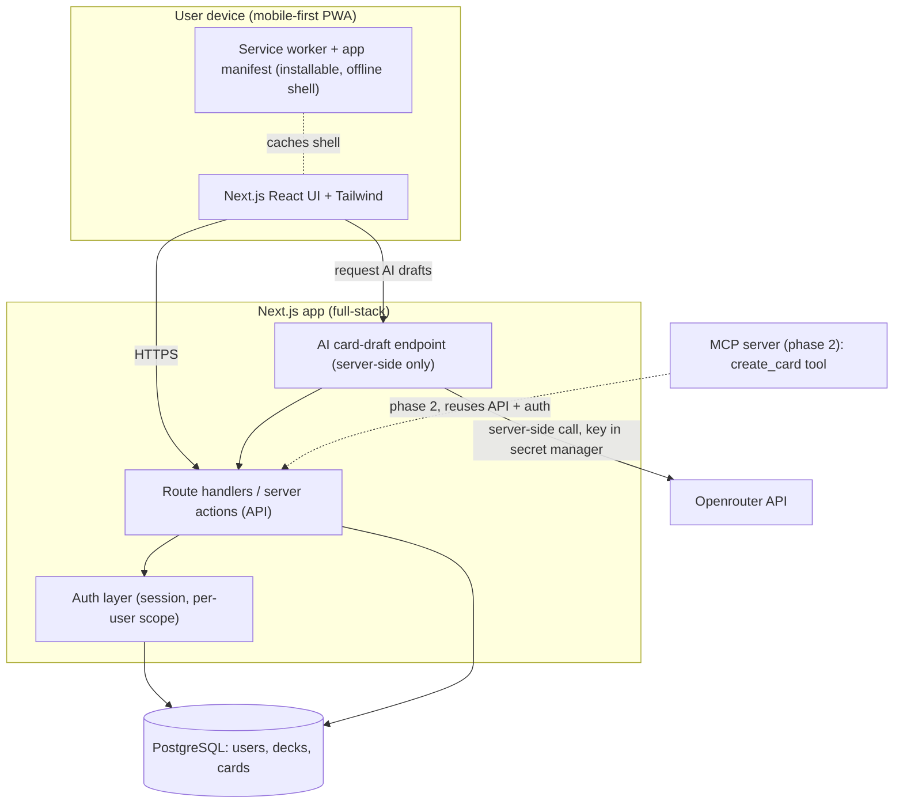
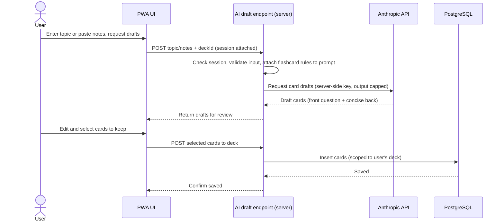
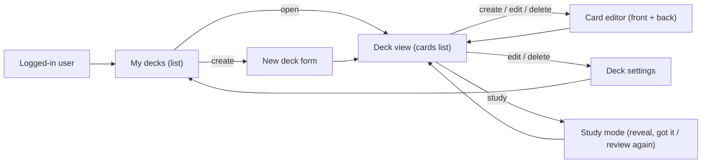

# PRD: Flashcards app with AI-assisted card creation

Status: Draft for review
Last updated: 2026-05-30

---

## Summary

Build a mobile-first flashcards web app where a signed-in user creates decks, fills each deck with cards, and studies them. Each card holds a question on the front and the answer on the back, following proven study technique: short, single-concept, active-recall cards. The app ships as a Progressive Web App (PWA) so users can install it and study on a phone. The standout feature is AI-assisted card creation: a user gives a topic or pastes notes, and the app drafts well-formed cards for a chosen deck.

Recommendation: ship a focused MVP that covers auth, deck CRUD, card CRUD, a simple study mode, and AI-assisted card creation. Keep the stack lean with one full-stack Next.js app plus a managed database and auth, so the team avoids running extra services in v1. Treat the MCP server and advanced spaced-repetition scheduling as a fast-follow phase, not MVP.

---

## What problem are we solving?

Most people make flashcards the wrong way. They write long, one-sided cue cards, cram the night before, and recognize content without recalling it. The result is hours of effort for weak retention. The technique that works, active recall plus spaced repetition, asks for short, double-sided, question-first cards reviewed on a schedule. Building good cards by hand is slow, which is the main reason people give up.

This app makes the right method the easy method: it guides users to short, question-first cards and uses AI to draft those cards from a topic or pasted notes, so the effort of making good cards drops to near zero.

---

## Expected outcomes

| Outcome                                 | Metric                                       | Target (first 90 days post-launch)     |
| -----------------------------------------| ----------------------------------------------| ----------------------------------------|
| Users create real study material        | Median cards per active user                 | [NEED: baseline; suggested target 20+] |
| AI lowers the cost of making cards      | Share of cards created with AI assist        | 40% or higher                          |
| Users come back to study                | Week-2 retention of registered users         | [NEED: target]                         |
| Cards follow the effective format       | Share of cards under 200 characters per side | 80% or higher                          |
| App is installable and usable on mobile | Lighthouse PWA + performance score on mobile | 90 or higher                           |

---

## Who would benefit?

- **Students** studying for exams who need fast, repeatable recall practice.
- **Self-learners** working through a course, a language, or a certification.
- **Anyone** who already uses flashcards (paper, Quizlet, Anki) but wants faster card creation and a clean mobile study flow.

Primary persona for the MVP: a student on a phone who wants to turn class notes into a study deck in minutes.

---

## Solution and requirements (MVP)

### Functional requirements

**Authentication**
- A visitor can register with email and password.
- A registered user can log in and log out.
- The app keeps the session secure and scoped to one user.
- A user only sees and edits their own decks and cards.

**Deck management (CRUD)**
- Create a deck with a title and an optional description.
- Read: list the user's decks and open a single deck with its cards.
- Update a deck's title and description.
- Delete a deck, which removes the cards inside it (with a confirmation step).

**Card management (CRUD)**
- Create a card with front text (the question or prompt) and back text (the answer).
- Read: list cards in a deck and view a single card's two sides.
- Update a card's front and back text.
- Delete a card (with a confirmation step).
- Card creation guides the user toward a single concept and a question-first front, following the study technique.

**Study mode (basic)**
- Step through a deck one card at a time.
- See the front, attempt recall, then reveal the back.
- Mark each card as "got it" or "review again" for the session.
- The app reshuffles or re-queues cards marked "review again" within the session.

**AI-assisted card creation (core differentiator)**
- From inside a deck, a user enters a topic or pastes notes and requests AI-drafted cards.
- The AI returns a set of draft cards, each with a short, question-first front and a concise back, shaped by the effective-flashcard rules (single concept, short, active question).
- The user reviews drafts, edits any card, and chooses which ones to save into the deck.
- The AI call runs server-side. The model API key never reaches the browser.

### Non-functional requirements

- **Mobile-first**: layouts target small screens first and scale up.
- **PWA**: installable, with an app manifest and a service worker that caches the app shell for offline launch. Card data sync is online-first for the MVP.
- **Performance**: fast first load on a mid-range phone (Lighthouse performance 90 or higher).
- **Accessibility**: meets WCAG 2.1 AA for color contrast, focus order, and screen-reader labels on core flows.
- **Security and privacy**: see the security section. The app stores the minimum data needed, which is email plus user-created study content.

---

## Out of scope and non-goals (MVP)

These are deliberately excluded from v1 to keep the build lean. Most are candidates for a fast-follow phase.

- **MCP server** that lets external AI clients create cards in a deck (phase 2; the API is designed to support it later).
- **Advanced spaced repetition** scheduling such as the SM-2 algorithm or a full Leitner box system with due dates across days. The MVP study mode is session-based only.
- **Sharing, collaboration, or public decks.**
- **Importing from Anki, Quizlet, or CSV.**
- **Images, audio, or rich media on cards** (MVP is text front and text back).
- **Social or gamification features** (streaks, leaderboards, rewards).
- **Native iOS or Android apps** (the PWA covers install on mobile).
- **Payments and subscriptions.** No cardholder data is processed in any phase of this plan.

---

## Risks and dependencies

| Risk or dependency                         | Impact                               | Mitigation                                                                                                |
| --------------------------------------------| --------------------------------------| -----------------------------------------------------------------------------------------------------------|
| AI drafts weak or off-topic cards          | Users lose trust in the core feature | Prompt the model with the effective-flashcard rules, keep the human review-and-edit step, cap card length |
| AI cost grows with usage                   | Operating cost rises                 | Set per-request output limits, rate-limit AI calls per user, monitor usage                                |
| Model API key leak                         | Security incident                    | Keep all AI calls server-side, store the key in a secret manager, never expose it to the client           |
| Scope creep into spaced repetition         | MVP slips                            | Hold the session-only study mode line; track SR as phase 2                                                |
| Vendor lock-in on managed auth or database | Migration cost later                 | Use standard Postgres and a portable schema; keep auth behind a thin internal interface                   |
| PWA offline expectations                   | Users expect full offline editing    | Set the expectation that v1 is online-first; offline app shell only                                       |

External dependencies: the AI model provider (Anthropic API), a managed Postgres database, and the hosting platform.

---

## Technical approach and architecture

### Guiding principle

Keep it lean. One full-stack Next.js app handles both the UI and the server-side API. A managed Postgres database and managed auth remove the need to run and secure extra services in v1. Add the MCP server only when AI card creation is proven and stable.

### Stack

- **Frontend and backend**: Next.js (App Router) with React and TypeScript. Server-side logic runs in Route Handlers and Server Actions, so there is no separate backend service in the MVP.
- **Styling**: Tailwind CSS, mobile-first.
- **Database**: PostgreSQL (managed, for example Supabase or Neon).
- **ORM**: we'll use suapabse, and use supabase migrations as well.
- **Auth**: Auth.js (NextAuth) with Supabase authentication.
- **AI**: Let's start with open router, and use it to call the AI model provider let's start with a free model(need to have good prompts).
- **PWA**: web app manifest plus a service worker (for example via `next-pwa` or `@serwist/next`) that caches the app shell.
- **Hosting**: a Next.js-friendly platform (for example Vercel, Cloudflare pages).
- **MCP (phase 2)**: a small server that exposes a `create_card` tool for a given deck. It calls the same internal API and reuses the same auth and validation.

### Big-picture architecture



### Data model

```mermaid
erDiagram
    USER ||--o{ DECK : owns
    DECK ||--o{ CARD : contains

    USER(managed by auth provider(supabase)) {
        uuid id PK
        string email "unique"
        string password_hash "or managed-auth reference"
        timestamp created_at
    }
    DECK {
        uuid id PK
        uuid user_id FK
        string title
        string description "optional"
        timestamp created_at
        timestamp updated_at
    }
    CARD {
        uuid id PK
        uuid deck_id FK
        text front_text "question / prompt"
        text back_text "answer"
        timestamp created_at
        timestamp updated_at
    }
```

Note: if managed auth owns the user record, the app keeps a thin profile row keyed to the auth user id instead of storing the password hash directly.

### AI-assisted card creation flow



### Deck and card CRUD flow



### Security and compliance


- **No hardcoded secrets** (SOC2): the AI model key, database URL, and auth secrets live in the platform secret manager and load as environment variables. None ship to the client bundle.
- **Encryption at rest** (SOC2): the managed Postgres database encrypts data at rest, and all traffic uses TLS in transit.
- **Least privilege** (SOC2): each user can read and write only their own decks and cards, enforced by row-level security or an equivalent ownership check on every query. Server-side service credentials stay out of the browser.
- **Minimal PII**: the app stores email plus user-created study content and nothing more. Redact any PII that appears in logs.
- **PCI DSS**: largely not applicable, since the app processes no cardholder data in any phase here. If a future phase adds payments or subscriptions, that brings PCI DSS into scope. Before building it, consult Steve ZoBell, Keith O'Queli, or Stephen Malone for direction.

---

## Expected deliverables

- A deployed, installable PWA covering auth, deck CRUD, card CRUD, basic study mode, and AI-assisted card creation.
- A documented data schema and API.
- A test suite covering the core flows.
- A short runbook for environment variables, secrets, and deploys.
- (Phase 2) An MCP server exposing a `create_card` tool for a given deck.

---

## Enablement

- A getting-started guide for new users (how to make a good card, how to use AI assist).
- Internal setup docs for running the app locally and configuring secrets.

---

## Open questions

- Should the MVP support a single sign-in method (email and password) only, or add one OAuth provider (for example Google) at launch? No. We'll use supabase auth with email and password.
- Does study mode need any cross-session memory in v1 (for example "cards I missed last time"), or is session-only acceptable for the MVP line? 
- Is the MCP server expected within the first release window, or is a phase-2 timeline acceptable? phase-2
- Which managed database and auth provider does the team prefer, given existing vendor agreements? supabase

---

## Documents

- Source brief and flashcard technique reference (provided by requester).
- [NEED: link to design files once UI prototyping begins in Foundation DS UI Builder]

---

## Tasks

Complexity scale: **Low** (well-understood, hours), **Medium** (a focused work item, about a day or two), **High** (multi-day, or involves integration and edge cases).

### Epic A: Project setup and foundation

| ID  | Task                                       | Complexity | Description                                                                                                     | Depends on |
| -----| --------------------------------------------| ------------| -----------------------------------------------------------------------------------------------------------------| ------------|
| A1  | Initialize Next.js + TypeScript + Tailwind | Low        | Set up the App Router project, Tailwind with a mobile-first config, linting, and formatting.                    | —          |
| A2  | Set up managed Supabase                    | Medium     | Provision the database, add the ORM (Drizzle), and configure the connection through the secret manager.         | A1         |
| A3  | Define schema and migrations               | Medium     | Implement the User, Deck, and Card tables with relations and run the first migration. (use supabase migrations) | A2         |
| A4  | Secrets and environment config             | Low        | Wire all secrets through environment variables and the platform secret manager. No keys in code (SOC2).         | A1         |

### Epic B: Authentication

| ID  | Task                             | Complexity | Description                                                                                                        | Depends on |
| -----| ----------------------------------| ------------| --------------------------------------------------------------------------------------------------------------------| ------------|
| B1  | Register with email and password | Medium     | Build sign-up with input validation and secure password hashing (use supabase authentication).                     | A3, A4     |
| B2  | Login and logout                 | Medium     | Build login, session creation, and logout.                                                                         | B1         |
| B3  | Per-user data isolation          | High       | Enforce ownership on every deck and card query via row-level security or equivalent checks (SOC2 least privilege). | A3, B2     |
| B4  | Route protection                 | Low        | Guard app routes so only authenticated users reach decks and cards.                                                | B2         |

### Epic C: Deck CRUD

| ID | Task | Complexity | Description | Depends on |
|---|---|---|---|---|
| C1 | Create deck | Low | Form and API to create a deck with title and optional description. | B3 |
| C2 | List and view decks | Low | List the user's decks and open a single deck with its cards. | B3 |
| C3 | Update deck | Low | Edit a deck's title and description. | C2 |
| C4 | Delete deck | Medium | Delete a deck and its cards, with a confirmation step and cascade. | C2 |

### Epic D: Card CRUD

| ID | Task | Complexity | Description | Depends on |
|---|---|---|---|---|
| D1 | Create card | Medium | Front (question) and back (answer) editor, with light guidance toward short, single-concept, question-first cards. | C2 |
| D2 | List and view cards | Low | Show cards in a deck and view a card's two sides. | C2 |
| D3 | Update card | Low | Edit a card's front and back text. | D2 |
| D4 | Delete card | Low | Delete a card with a confirmation step. | D2 |

### Epic E: Study mode

| ID | Task | Complexity | Description | Depends on |
|---|---|---|---|---|
| E1 | Card stepper with reveal | Medium | Step through a deck, show the front, reveal the back on tap. | D2 |
| E2 | Session feedback and re-queue | Medium | Mark "got it" or "review again," and re-queue missed cards within the session. | E1 |

### Epic F: AI-assisted card creation (core)

| ID | Task | Complexity | Description | Depends on |
|---|---|---|---|---|
| F1 | Server-side AI draft endpoint | High | Build a server endpoint that takes a topic or notes plus a deck id, prompts the model with the flashcard rules, and returns draft cards. Key stays server-side (SOC2). | A4, C2 |
| F2 | Draft review and edit UI | Medium | Show AI drafts, let the user edit each card, and select which to keep. | F1, D1 |
| F3 | Save selected drafts to deck | Low | Persist chosen cards into the target deck, scoped to the user. | F2, D1 |
| F4 | Guardrails: limits and rate limiting | Medium | Cap output length per card and per request, and rate-limit AI calls per user to control cost and abuse. | F1 |

### Epic G: PWA and mobile polish

| ID | Task | Complexity | Description | Depends on |
|---|---|---|---|---|
| G1 | Web app manifest and install | Low | Add the manifest and icons so users can install the app. | A1 |
| G2 | Service worker (app shell cache) | Medium | Cache the app shell for fast launch and offline open. Online-first for data. | G1 |
| G3 | Mobile-first review and a11y pass | Medium | Tune layouts for small screens and meet WCAG 2.1 AA on core flows. | C2, D2, E1 |

### Epic H: Quality and launch

| ID | Task | Complexity | Description | Depends on |
|---|---|---|---|---|
| H1 | Tests for core flows | Medium | Cover auth, CRUD, and AI save paths with automated tests. | B2, C1, D1, F3 |
| H2 | Security review against SOC2 controls | Medium | Verify no hardcoded secrets, encryption at rest, and least-privilege access before launch. | B3, F1 |
| H3 | Performance and Lighthouse pass | Low | Hit the mobile performance and PWA score targets. | G2, G3 |

### Phase 2 (post-MVP)

| ID  | Task                               | Complexity | Description                                                                                                            | Depends on |
| -----| ------------------------------------| ------------| ------------------------------------------------------------------------------------------------------------------------| ------------|
| P1  | MCP server with `create_card` tool | High       | Expose a tool that lets an external AI client add a card to a given deck, reusing the app's API, auth, and validation. | F3         |
| P2  | Spaced repetition scheduling       | High       | Add cross-session scheduling (Leitner boxes or SM-2) with due dates.                                                   | E2         |
| P3  | Add one OAuth provider             | Medium     | Offer a social sign-in option alongside email and password.                                                            | B2         |

---

## Decision and change log

| Date       | Decision                                                            | Rationale                                                          |
| ------------| ---------------------------------------------------------------------| --------------------------------------------------------------------|
| 2026-05-30 | One full-stack Next.js app for the MVP, no separate backend service | Meets the requirements with less to run and secure                 |
| 2026-05-30 | MCP server moved to phase 2                                         | The brief marks it optional; ship and prove AI card creation first |
| 2026-05-30 | Study mode is session-only in the MVP                               | Keeps scope tight; advanced spaced repetition tracked as phase 2   |